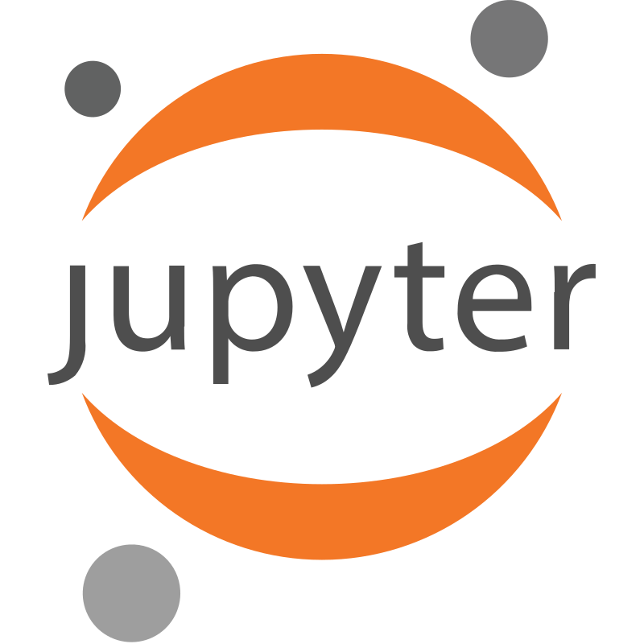

<h1 align="center">
    
</h1>

I’m a passionate Machine Learning Engineer and Computer Vision Engineer, committed to building impactful ML solutions and pushing the boundaries of model development. I aim to specialize in deep learning, computer vision, and end-to-end data science.

Explore my portfolio for my latest ML and vision projects, and let’s connect to collaborate on innovative, data-driven initiatives!

<h2 align="center">🚀 Languages and Tools I Use</h2>

<a target="_blank" href="https://raw.githubusercontent.com/devicons/devicon/master/icons/postgresql/postgresql-original-wordmark.svg" style="display: inline-block;">

<h2 align="center">⚡️ Where to find me</h2>

    
    
    
    

 

<h2 align="center"> 📊 GitHub Stats </h2>

  

  
  

  
  

  <picture>
    <source media="(prefers-color-scheme: dark)" srcset="https://github.com/Ayaan-Ali-Khan/Ayaan-Ali-Khan/blob/output/github-snake-dark.svg">
    <source media="(prefers-color-scheme: light)" srcset="https://github.com/Ayaan-Ali-Khan/Ayaan-Ali-Khan/blob/output/github-snake.svg">
    
  </picture>

  

